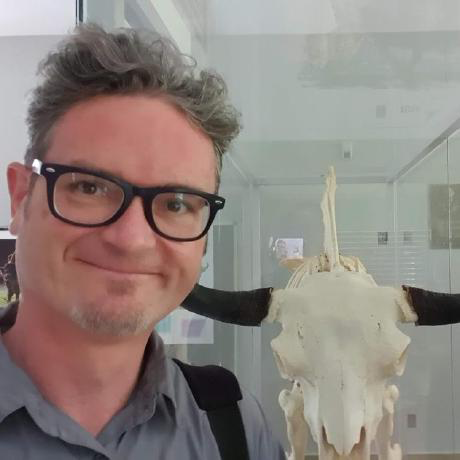

## Your instructor

[{fig-align="left" width="250"}](https://weharris.me)

## Learning objectives

1.  Analyse and solve problems using computational thinking, applying fundamental concepts of computer science
2.  Design and implement algorithms in different programming languages
3.  Evaluate and improve the correctness, design, and style of code
4.  Synthesise knowledge of programming concepts to create apps
5.  Apply the principles of data management for the storage and retrieval of information

## Meetings

**Meetings** will be held in person in Telford, Station Quarter. Autumn 2025: Check your personal schedule for room, day, time.

**Notes and brief lectures** will introduce the weekly topic and sometimes involve live coding demonstration of key concepts. Lectures and notes should be reviewed prior to attending each weekly session.

**Tutorials and activities** will demonstrate concepts relevant to various scenarios, with a focus on the problem solving during our live sessions. Tutorials will often be demonstrated and should also be completed individually. That is, run the code yourself.

**Flipped classroom** will be used exclusively for this module. This reverses traditional teaching by having students go through new material independently, through videos or readings, before class meetings. Then, class time is used for discussion, problem-solving, assessments, and applying ideas. This lets students work through content at their own pace and ensures that support from teachers and peers is available when tackling challenging concepts. The idea is to make learning more active, collaborative, and confidence-building. Also, it is usually more fun than traditional lectures!

Material may be livestreamed to YouTube and recorded for later viewing.

## Online resources

All lecture notes, assignment instructions, an up-to-date schedule, and other course materials may be found on the [module website](SQ4007-2025.github.io/website). This material is completely open and accessible to all without login or other barriers.

[Harper Adams module website](https://vle.harper-adams.ac.uk/course/view.php?id=282) (university enrolled students only, requires login)

-   [Discord - join the community](https://discord.gg/dnNTE6xhhu) - for live discussion and support
-   [GitHub - the module repository](https://github.com/SQ4007-2025) - for the module materials
-   [YouTube - The Statistics Lab channel](https://www.youtube.com/@thestatisticslab) - for live streams and recordings
-   [Twitch - the DataGiri channel](https://www.twitch.tv/DataGiri) - for live streams and recordings
-   [Twitter - Follow Ed's account](https://x.com/EdHarris9000) - for information, and memes

## Assessments

### Assessment 1

**Homework:** These homework problem sets will typically be distributed throughout the module and are designed to test the grasp and application of programming concepts ranging from basic syntax to topics like data structures and algorithms. Each set will consist of practical tasks involving various programming challenges.

### Assessment 2

**Project:** This is an opportunity to apply programming skills in developing your own software solution. This project encourages creativity and innovation, allowing you to choose an appropriate programming language and build an application that is personally meaningful, solves real-world problems, or potentially impacts the community or world at large.

For the project you can opt to work individually or collaborate with up to two other classmates, with the expectation that each member contributes equally to the project design and implementation. The complexity of the project should reflect the size of the group, with group projects expected to be more intricate than individual ones. The final project is assessed based on the project complexity and scope, the effectiveness of the implemented solution, creativity, and the overall quality of the code. For group projects, the assessment also considers individual contributions and the collaborative effort. ***NB*** for group projects, the scope and ambition of the project should reflect the size of the group.

## Readings (optional)

While there is no textbook for the module, these may be of interest.

**Articles** (Classic papers in programming and computing)

[Beck, K., Cunningham, W., 1989. A laboratory for teaching object oriented thinking. ACM SIGPLAN Notices. ](pdfs/Beck and Cunningham - 1989 - A laboratory for teaching object oriented thinking.pdf)

Brewer, E., 2012. CAP twelve years later: How the “rules” have changed. Computer 45, 23–29.

Brooks, F., 1987. No Silver Bullet Essence and Accidents of Software Engineering. Computer 20, 10–19.

Codd, E.F., 1970. A relational model of data for large shared data banks. Commun. ACM 13, 377–387.

Dijkstra, E.W., 1988. On the cruelty of really teaching computing science.

Dijkstra, E.W., 1972. The humble programmer. Commun. ACM 15, 859–866.

Dijkstra, E.W., 1968. Letters to the editor: go to statement considered harmful. Commun. ACM 11, 147–148.

Goldberg, D., 1991. What every computer scientist should know about floating-point arithmetic. ACM Comput. Surv. 23, 5–48.

Hoare, C., 1969. An axiomatic basis for computer programming. Communications of the ACM.

Stroustrup, B., 1988. What is object-oriented programming? IEEE Software 5, 10–20.

Thompson, K., 1984. Reflections on trusting trust. Commun. ACM 27, 761–763.

**Blogs** (Writings by data science leaders)

[Julia Silge's Blog](https://juliasilge.com/blog/) :: [Andrew Gelman's Blog](https://statmodeling.stat.columbia.edu/) :: [Simply Statistics](https://simplystatistics.org/) :: [R bloggers](https://www.r-bloggers.com/) :: [Ethan Mollick's Blog](https://www.oneusefulthing.org/)

**Books** (Classic texts and essay collections about computing)

Bentley, J., 1988. More Programming Pearls: Confessions of a Coder: Confessions of a Coder. Addison-Wesley.

Bhargava, A., 2024. Grokking Algorithms. Manning.

Hermans, F., 2021. The Programmer’s Brain: What every programmer needs to know about cognition. Manning.

Hunt, A., Thomas, D., 1999. The Pragmatic Programmer: From Journeyman to Master. Addison-Wesley.

Kenett, R.S., Redman, T.C., 2019. The Real Work of Data Science: Turning data into information, better decisions, and stronger organizations. Wiley.

McConnell, S., 2004. Code Complete: A Practical Handbook of Software Construction, Second Edition. Microsoft Press.

## Five tips for success

Your success on this module depends very much on you and the effort you put into it. Like any learning, the burden of engaging with the material is on you. The module staff and I will help you be providing you with materials and answering questions and setting a pace, but for this to work you must do the following:

1.  Complete all the preparation work before class.
2.  Ask questions. As often as you can. In class, out of class. Ask me, ask the course staff, ask your friends, ask the person sitting next to you. This will help you more than anything else. If you get a question wrong on an assessment, ask us why. If you're not sure about the homework, let's talk about it. If you hear something on the news that sounds related to what we discussed, share it and let's discuss. If the reading is confusing, ask.
3.  Do some of the optional readings, read and share relevant Twitter/X posts, read and share relevant Hacker News articles. Consider joining or forming a reading group that meets once per week to discuss.
4.  Do the homework and the tutorials. The earlier you start, the better. It's not enough to just mechanically plow through the exercises. You should ask yourself how these exercises relate to earlier material, and imagine how they might be changed (to make questions for an exam, for example.)
5.  Don't procrastinate. If something is confusing to you in Week 2, Week 3 will become more confusing, Week 4 even worse, and eventually you won't know where to begin asking questions. Don't let the week end with unanswered questions. But if you find yourself falling behind and not knowing where to begin asking, ask for help, and let us help you identify a good (re)starting point.

## Module policies

The essence of all work that you submit to this course must be your own. Unless otherwise specified, collaboration on assessments (e.g., assignments, labs, problem sets, projects, quizzes, or tests) is not permitted except to the extent that you may ask classmates and others for help so long as that help does not reduce to another doing your work for you. Generally speaking, when asking for help, you may show your work to others, but you may not view theirs, so long as you and they respect this policy’s other constraints.

**Reasonable**

-   Communicating with classmates about assessments in English (or some other spoken language), and properly citing those discussions.
-   Discussing the course’s material with others in order to understand it better.
-   Helping a classmate identify a bug in their code, as by viewing, compiling, or running their code after you have submitted that portion of the pset yourself.
-   Incorporating a few lines of code that you find online or elsewhere into your own code, provided that those lines are not themselves solutions to assigned work and that you cite the lines’ origins.
-   Sending or showing code that you’ve written to someone, possibly a classmate, so that they might help you identify and fix a bug.
-   Submitting the same or similar work to this course that you have submitted previously to this course.
-   Turning to the web or elsewhere for instruction beyond the course’s own, for references, and for solutions to technical difficulties, but not for outright solutions to assigned work.
-   Using AI-based software to ask questions, but not presenting its answers as your own.
-   Whiteboarding solutions with others using diagrams or pseudocode but not actual code.
-   Working with (and even paying) a tutor to help you with the course, provided the tutor does not do your work for you.

**Not Reasonable**

-   Accessing a solution to some assessement prior to (re-)submitting your own.
-   Accessing or attempting to access, without permission, an account not your own.
-   Asking a classmate to see their solution to some assessment before submitting your own.
-   Failing to cite (as with comments) the origins of code or techniques that you discover outside of the course’s own lessons and integrate into your own work, even while respecting this policy’s other constraints.
-   Giving or showing to a classmate a solution to an assessment when it is they, and not you, who is struggling to solve it.
-   Paying or offering to pay an individual for work that you may submit as (part of) your own.
-   Providing or making available solutions to assessments to anyone, whether a past, present, or prospective future student.
-   Searching for or soliciting outright solutions to assessments online or elsewhere.
-   Splitting an assessment’s workload with another individual and combining your work.
-   Submitting (after possibly modifying) the work of another individual beyond the few lines allowed herein.
-   Submitting the same or similar work to this course that you have submitted or will submit to another course, unless explictly allowed.
-   Using AI-based software (including ChatGPT, GitHub Copilot, the new Bing, et al.) that suggests answers or lines of code.
-   Viewing another’s solution to an assessment and basing your own solution on it.